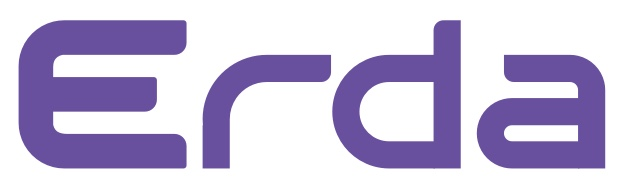

# Frontend UI for Erda platform.

## 📣 Introduction
Erda is an open-source platform created by Terminus to ensuring the development of microservice applications.
This repository is about Erda's User Interface.

## ✨ Platforms

- DevOps platform
- Microservice Governance platform
- Multi-Cloud Management platform
- Edge computing platform
- Fast-Data platform(open source soon)

For a detailed introduction, please check the [official website](https://erda.cloud).

## 🖥 Environment Support

Modern browsers and Internet Explorer 11 (with [polyfills](https://stackoverflow.com/questions/57020976/polyfills-in-2019-for-ie11))

|  Firefox |  Chrome |  Safari |
| --- | --- | --- |
| last 2 versions | last 2 versions | last 2 versions |

## 🚀 Quick Start
TODO

## Architecture
Technology stack：

* UI library: Ant Design & Terminus NUSI
* state management: cube-state
* i18n: i18next
* bundler: webpack

This project contain the following parts:
* cli: command line interface for erda-ui, help to quick setup develop environment and pack files to docker images.
* core: provide registration framework and core functions such as initialize cube-state and i18n etc.
* shell: provide layout, user and common components for business modules.
* scheduler: support module federation style development, register and navigate to multiple modules.
* modules: business modules, each of these can develop and publish standalone.

architecture of development mode

## 🔗 Links

- [Official Website](https://erda.cloud)(comming soon)
- [User Docs](https://erda-docs.app.terminus.io/)
- [Backend project](https://github.com/erda-project/erda)

## 🤝 Contributing 

We welcome all contributions. Please read our [CONTRIBUTING.md](https://github.com/erda-project/erda-ui/blob/master/.github/CONTRIBUTING.md) first. You can submit any ideas as [pull requests](https://github.com/erda-project/erda-ui/pulls) or as [GitHub issues](https://github.com/erda-project/erda-ui/issues?template=bug-template). If you'd like to improve code, check out the [Development Instructions](https://github.com/erda-project/erda-ui/wiki/Development) and have a good time! :)

## Contact Us

We look forward to your connecting with us, you can ask us any questions.

- Email: erda@terminus.io
- 知乎：[Erda技术团队](https://www.zhihu.com/people/erda-project) (A Chinese knowledge community, similar to Quora.)
- 微信公众号（Wechat）:

	

## License
Erda is under the AGPL 3.0 license. See the [LICENSE](/LICENSE) file for details.
