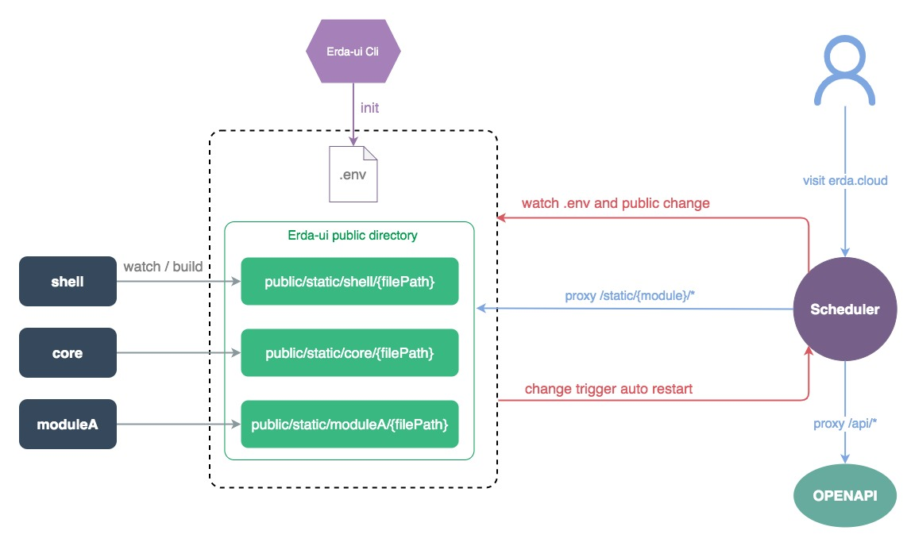

# Erda-ui technology stack and architecture introduction

[中文](./introduction_zh.md) | English

Erda-ui is the front-end project of the Erda platform, including all the interface function codes of the platform. The following describes the technology stack and architecture used in this project.


## Technology Stack
Basic framework: React
Microservice framework: [Module Federation](https://github.com/module-federation)
Component library: [Antd 4.x](https://github.com/ant-design/ant-design)
State management: [cube-state](https://github.com/daskyrk/cube-state)
CSS framework: [tailwindcss](https://github.com/tailwindlabs/tailwindcss)
Centralized routing: [react-router-config](https://github.com/remix-run/react-router/tree/main/packages/react-router-config)
Request library: superagent (old) + axios
Chart library: Echarts
Internationalization: i18next
Build tool: Webpack
Unit test: Jest
Automated testing: [Playwright](https://github.com/microsoft/playwright)
Node layer: [NestJs](https://nestjs.com/)


## Architecture



The whole project is based on the module federation and is divided into the following modules:
### core
The core library of the project mainly did the following:
  * Global routing initialization, providing module routing registration
  * Global public state (user information, routing information, global loading) initialization, providing module state space (store) registration
  * Provide basic component library after unified processing
  * Unified interface processing logic, providing service layer creation method
  * Provide internationalization methods

### [cli](https://www.npmjs.com/package/@erda-ui/cli?activeTab=versions)
The command line tool of the project, provide the following commands
  * Project initialization
  * Project one-click operation
  * Project construction
  * Packaged into a docker image
  * International translation
  * Generate service layer code
  * Check and add file License header

### scheduler
Based on the back-end service layer of NestJs, the current functions include:
  * Request forwarding
  * Static file service

In the future, it will continue to support SSR, server-side capability encapsulation, and cooperating with componentized protocols to achieve some richer capabilities.

### shell
The main code of the entire project, the directory structure is as follows:

-app: business code
  -charts: chart component based on Echarts package
  -common: global common component library, tool method, configuration, store, service
  -config-page: componentized protocol framework and components
  -configForm: configuration form framework, similar to Formily
  -layout: global layout components
  -locales: internationalized files
  -menus: global menu configuration for each platform
  -modules: specific business modules, such as project, application and other modules under the dop platform
    -dop
      -entry.js: module entry, registered routing, store, internationalization, etc.
      -router.js: Module routing configuration
      -pages: module page
      -stores: state model under the module
      -services: Each page under the module corresponds to an api interface file
      -locales: internationalized files under the module
      -types: Type definition under the module
      -components: common components under the module that can be reused for other modules
  -org-home: Personal workbench
  -static: static files
  -styles: global style, color wheel
  -user: user module
  -views: index.html template related files
  -yml-chart: assembly line flowchart component
-modules: completely independent modules, currently including login module and market module
  -login: login module
  -market: market module
-auto_test: automated test cases
-test: Unit test case
-tools: script tools
-mf.config.js: module federation configuration
-tailwind.config.js: tailwind style library configuration

### public
The code build product directory, the build results of the shell, core and other directories will be placed in this directory according to the directory.

## Development Process
### Need store method
Take adding a routing page as an example:
1. In the `types` directory of the corresponding module, define the back-end model and interface type files, for example: `project.d.ts`
2. According to the api interface definition provided by the backend, refer to the interface file definition in the other `services` directory to call the api interface
3. Refer to other files in the `stores` directory to define the store state model of the page. If the page does not need to share state, you do not need to define the store file
4. Add routing configuration under router of the corresponding module
5. Implement page components and business logic in the `pages` directory
6. Wrap the Chinese to be translated in the form of `i18n.d('中文')`, execute `erda-ui i18n`, and follow the prompts for automatic internationalization
8. If a global public component is added under the `shell/app/common` directory, the corresponding single test case needs to be submitted
7. Check the warnings, errors and type hints in the code, and can’t submit code that contains errors


### No need to store
1. Use the erda-ui cli command to generate the service layer and type definition through the swagger document on the backend (to be improved)
2. In the component, use the interface data directly through hooks, for example
```tsx
  // UseData when you only need data, and useLoading when you only need loading
  const [clusterList, loadingList] = getClusterList.useState();

  useMount(() => {
    const userOrgId = orgStore.getState((s) => s.currentOrg.id);
    getClusterList.fetch({ orgID: userOrgId });
  });
```
3. The next step is the same as that of the need to store. Step 4


### Component development method
Take adding a routing page as an example:
1. Enter the componentized debugging page, assemble the business scenario page, configure mock data and interaction
2. If there is no required component, it needs to be newly developed and placed in the `shell/app/config-page/components` directory
3. Execute `gen-cp-all` to generate component documentation to the `shell/app/config-page/docs` directory
4. Provide the configured scene data structure to the backend, and then add routing files according to the normal process
5. Perform the internationalization of the component itself according to the ordinary process, and the internationalization of data is controlled by the backend
