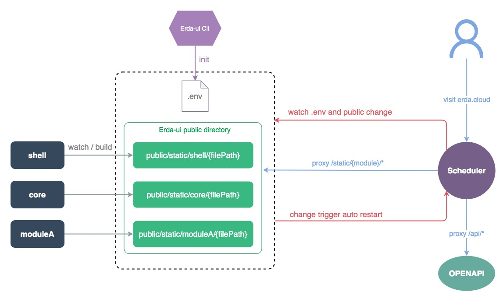

# Erda-ui 技术栈及架构介绍

中文 | [English](./introduction_en.md)

Erda-ui 是 Erda 平台的前端工程，包括平台所有的界面功能代码，下面介绍本工程中使用的技术栈及架构。


## 技术栈
基础框架：React
微服务框架：[模块联邦](https://github.com/module-federation)
组件库：[Antd 4.x](https://github.com/ant-design/ant-design)
状态管理：[cube-state](https://github.com/daskyrk/cube-state)
CSS 框架：[tailwindcss](https://github.com/tailwindlabs/tailwindcss)
集中式路由：[react-router-config](https://github.com/remix-run/react-router/tree/main/packages/react-router-config)
请求库：superagent（旧） + axios
图表库：Echarts
国际化：i18next
构建工具：Webpack
单元测试：Jest
自动化测试：[Playwright](https://github.com/microsoft/playwright)
Node 层：[NestJs](https://nestjs.com/)


## 架构



整个项目基于模块联邦，分为如下几个模块：
### core
项目核心库，主要做了以下内容：
  * 全局路由初始化，提供模块路由注册
  * 全局公共状态（用户信息、路由信息、全局 loading）初始化，提供模块状态空间（store）注册
  * 提供统一处理后的基础组件库
  * 统一接口处理逻辑，提供 service 层创建方法
  * 提供国际化方法

### [cli](https://www.npmjs.com/package/@erda-ui/cli?activeTab=versions)
项目的命令行工具，提供以下命令
  * 项目初始化
  * 项目一键运行
  * 项目构建
  * 打包成 docker 镜像
  * 国际化翻译
  * 生成 service 层代码
  * 检查、添加文件 License 头

### scheduler
基于 NestJs 的后端服务层，目前的功能包括：
  * 请求转发
  * 静态文件服务

未来会继续支持如 SSR、服务端能力封装，以及配合组件化协议实现一些更丰富的能力。

### shell
整个项目的主要代码，目录结构如下：

- app：业务代码
  - charts：基于 Echarts 封装的图表组件
  - common：全局公用的组件库、工具方法、配置、store、service
  - config-page：组件化协议框架及组件
  - configForm：配置式表单框架，类似于 Formily
  - layout：全局的布局组件
  - locales：国际化文件
  - menus：全局各平台的菜单配置
  - modules：具体业务模块，例如 dop 平台下分为 project、application 等模块
    - dop
      - entry.js：模块入口，注册路由、store、国际化等
      - router.js：模块路由配置
      - pages：模块页面
      - stores：模块下的状态模型
      - services：模块下每个页面对应一个 api 接口文件
      - locales：模块下的国际化文件
      - types：模块下的类型定义
      - components：模块下可以给其他模块复用的公用组件
  - org-home：个人仪表盘
  - static：静态文件
  - styles：全局样式、色盘
  - user：用户模块
  - views：index.html 模板相关文件
  - yml-chart：流水线流程图组件
- modules：完全独立的模块，目前包括登录模块、市场模块
  - login：登录模块
  - market：市场模块
- auto_test：自动化测试用例
- test：单元测试用例
- tools：脚本工具
- mf.config.js：模块联邦配置
- tailwind.config.js：tailwind 样式库配置

### public
代码构建产物目录，shell、core 等目录的构建结果，会按目录放在这个目录下。

## 开发流程
### 需要 store 方式
以新增一个路由页面为例：
1. 在对应模块的 `types` 目录下，定义后端模型及接口类型文件，例如：`project.d.ts`
2. 根据后端提供的 api 接口定义，参考其他 `services` 目录下的接口文件定义 api 接口调用
3. 参考其他 `stores` 目录下文件定义该页面的 store 状态模型，如果该页面不需要共享状态，则不需要定义该 store 文件
4. 在对应模块的 router 下新增路由配置
5. 在 `pages` 目录下实现页面组件和业务逻辑
6. 将待翻译中文用 `i18n.d('中文')` 的形式包裹，执行 `erda-ui i18n`，按照提示进行自动国际化
8. 如果在 `shell/app/common` 目录下新增了全局公共组件，需要提交对应的单测用例
7. 检查代码中的警告错误、类型提示，不能提交包含错误的代码


### 无需 store 的方式
1. 通过后端的 swagger 文档，使用 erda-ui cli 命令，生成 service 层和类型定义（待完善）
2. 组件中，直接通过 hooks 的方式使用接口数据，例如
```tsx
  // 只需要数据时可用 useData，只需要 loading 时可用 useLoading
  const [clusterList, loadingList] = getClusterList.useState();

  useMount(() => {
    const userOrgId = orgStore.getState((s) => s.currentOrg.id);
    getClusterList.fetch({ orgID: userOrgId });
  });
```
3. 后面和需要 store 的方式第 4 步开始相同


### 组件化开发方式
以新增一个路由页面为例：
1. 进入组件化调试页面，组装业务场景页面，配置 mock 数据和交互
2. 如果没有需要的组件，需要新开发并放到 `shell/app/config-page/components` 目录下
3. 执行 `gen-cp-all`，生成组件的文档到  `shell/app/config-page/docs` 目录下
4. 将配置好的场景数据结构提供给后端，然后按照普通的流程添加路由文件
5. 按照普通流程执行组件本身的国际化，数据的国际化由后端来控制
